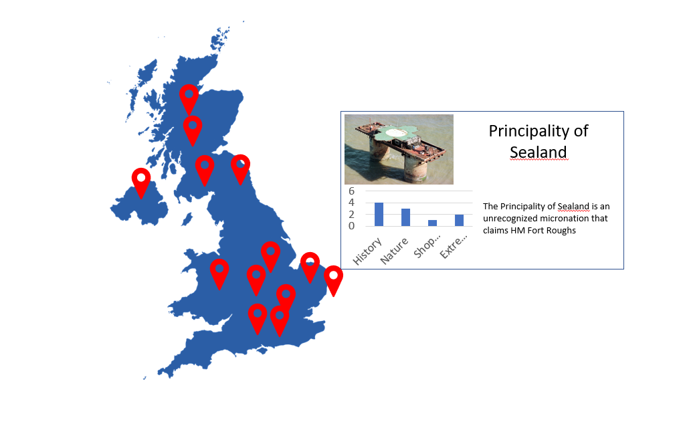

# Travel Planner

**Travel Agent Simulator**

## מהות המשחק
סימולטור בו אתה מתכנן טיולים ללקוחות.
משחק מאתגר ואין סופי.
 הנותן לשחקן עניין ומלמד גאוגרפיה

כל הפלטפורמות

---

## רכיבים רשמיים

המחישו את התשובות שלכם בעזרת ציורי-מסך.

### 1. שחקנים

* קהל היעד: 12+ מתאים כל הרמות, תחומי עניין: משחקי סימולציה, גאוגרפיה

* שחקן יחיד

* כל השחקנים בעולם מתחרים זה בזה

### 2. יעדים 

* המטרה להשיג כמה שיותר נקודות עד ידי התאמה טובה ביותר של מסלול טיול לבקשת הלקוח
* עם סיום הלומדה מציגים לשחקן את טבלת המובילים שם הוא לומד שהביצועים שלו נותנים לו ניקוד והוא מתחרה בשאר השחקנים בעולם

### 3. תהליכים

* הסבר מהיר על המשחק בעזרת תכנון טיול פשוט 

*	במסך הראשי יש טבלה של כל ההזמנות הקיימות 
השחקן יכול לעיין בהזמנות ולבחור את זאת שמעניינת אותו
לאחר שבחר הזמנה הוא נכנס לתהליך התכנון
בתהליך התכנון הוא בוחר יעדים ומסדר אותם על ציר זמן 
כאשר נגמר הזמן \ הוא מגיש את התוכנית 
מוצג בפני השחקן דוח של ההזמנה עם חישוב הניקוד שלו. 

כל הפעולות במשחק נעשות עם עכבר

### 4. חוקים

* איזה חוקים יגבילו את פעולות השחקן במשחק?

אפשרות לחצות גופי מים רק במקומות שמאפשרים זאת.
הכסף שהלקוח נותן מגביל את המקומות והדברים שניתן לעשות
טווח הזמן של הטיול מגביל את המקומות שאפשר ללכת אליהם וכמות הזמן שניתן לשהות בהם.

* לפי איזה חוקים ייקבעו תוצאות של פעולות במשחק?

תחומי העניין של הלקוח
כמות הכסף שנשארה ללקוח לאחר התכנון
אחוז הזמן המת בתכנון

* איך השחקן ילמד את חוקי המשחק?

תהיה לומדה קצרה שתסביר איך השחקן משתמש בממשקים הנגישים לו, ותינתן לו דוגמא קלה של הזמנת טיול מלקוח כדי שהיכול להתנסות בה קצת בעצמו

### 5. משאבים
* מה יהיו המשאבים במשחק?

1. כסף: כמות התקציב שהלקוח נותן לטיול
2. זמן הטיול: כמות הזמן שהטיול צריך לקחת
3. זמן ההזמנה: כמות הזמן שיש לשחקן לייצר מסלול עבור טיול בשביל 
הלקוח לפני שהבקשה פגת תוקף ועוברת למתחרה.

* איך המשאבים הללו יועילו לשחקן?

המשאבים הם המשחק, הם לא נועדו להועיל לשחקן כיוון שמטרת השחקן היא לנצל את המשאבים נכון.

### 6. עימותים

* בין השחקן לעצמו (דילמות)? 

עיקר המשחק הוא דילמות, להחליט מה המסלול הכי טוב שניתן לקחת עבור הלקוח תחת המגבלות שניתנו על ידי הלקוח.

### 7. גבולות

* העולם הוא סגור
*  המשחק הוא שטוח שצורתו היא המדינה בה הלקוח רוצה לטייל בה 

 איך המשחק יראה לשחקן את הגבולות?
הגבולות יראו לפי המפה שתינתן לו של המדינה בה הלקוח מעוניין לטייל
 
 משמעות: המפה היא מפה אמיתית מהעולם לכן משמעות המפה היא לדמות את אותה מדינה.
 
 ניידות: לא רלוונטי
 
 התמצאות: לא רלוונטי
 
עניין: המפה תציג מקומות מעניין אפשריות שיש בכל מדינה, 
כגון נקודות אטרקציה או מקומות של סצנות אייקוניות 
בסרטים

הכוונה: לא רלוונטי

### 8. תוצאות

* כמה תוצאות אפשריות יהיו למשחק, ומה הן יהיו?
לקוח מרוצה ולקוח לא מרוצה
* עד כמה התוצאה תלויה במזל לעומת כישרון? 
המשחק הוא בעיקר עניין של כישרון בתכנון אך עשוי לערב מעט מזל בהזמנות שהוא עשוי לקבל מהלקוח.

---

## סקר שוק

[Poly Bridge](https://store.steampowered.com/app/367450/Poly_Bridge/)

משחק בו בכל שלב אתה מתכנן גשר. יש לך כמות כסף מוגבלת והמטרה היא לבנות את הגשר בצורה הכי יעילה וחסכנית שיש תוך פיתרון החידה שקיבלת.

המשחק שלנו ברעיון עושה את האותו הדבר אך במקום לבנות גשר, אנו מתכננים טיול.

[112 Operator](https://store.steampowered.com/app/793460/112_Operator/)

משחק בו אתה משחק בתור כונן של שירותי הצלה. כל כמה זמן אתה מקבל שיחה מאזרח בצרה ואחרי שאתה מבין את הבעיה של אותו אזרח עליך לנווט כוחות מתאימים לאירוע.

[House Flipper](https://store.steampowered.com/app/613100/House_Flipper/)

הדמיון בין המשחק שלנו למשחק זה היינו בכך שאתה פותר בעיה ללקוח , וכאן נגמר הדמיון.

מבין הרכיבים הרשמיים, 
איזה רכיב (או רכיבים) ידגיש ביותר את הייחוד והמקוריות של המשחק שלכם, לעומת משחקים דומים הקיימים בשוק?

תהליכים המשחק שלנו פשוט להבנה מאתגר ומלמד על מדינות בעולם

